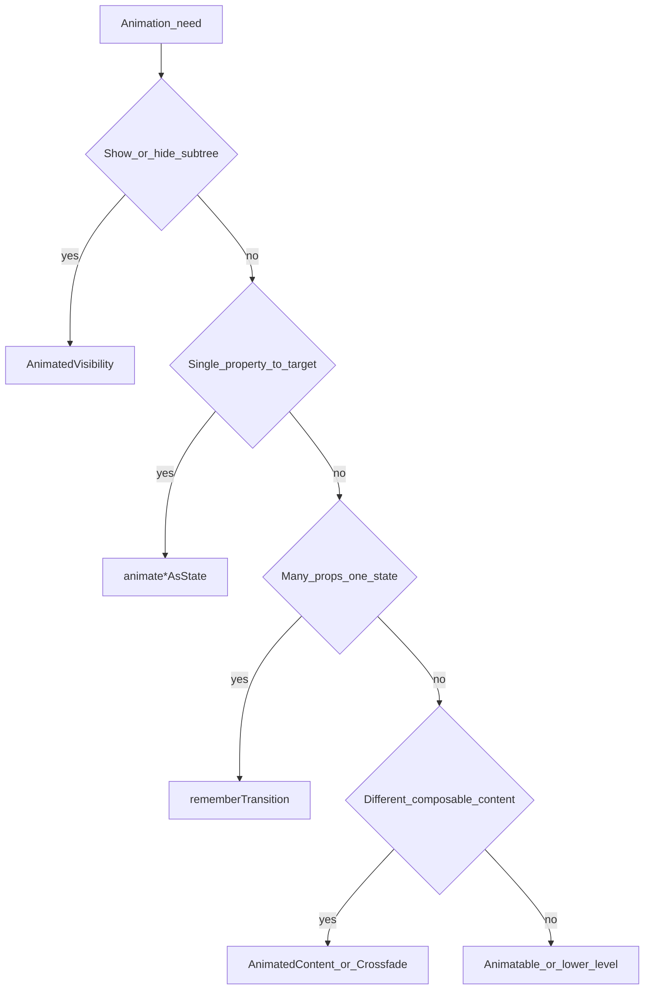

# Compose: animations

## Core principle

Pick the **smallest API that matches the problem**: built-in visibility and layout transitions first, then a single animated value, then a shared transition object when several values must move together, then gesture-level or imperative APIs when the framework cannot express the motion.

## Review procedure

1. Identify the visual job: show/hide, one value, coordinated values, content swap, size change, or gesture-driven motion.
2. Choose the smallest API from the table below.
3. Check lifecycle semantics: should hidden content leave composition, keep focus/state, or only become transparent?
4. Check identity: for state-holder wrappers, choose `AnimatedContent.contentKey` by visual shape rather than payload churn.
5. Check performance: keep frame-rate animation values as `State` and read them in layout/draw block modifiers when possible.
6. Escalate to `Animatable` or lower-level APIs only when target-state animation cannot express the motion.

## Pick the smallest animation API

| Need | API |
|---|---|
| Show or hide a subtree with enter/exit semantics; content is removed after exit completes | [`AnimatedVisibility`](https://developer.android.com/develop/ui/compose/animation/composables-modifiers#animatedvisibility) |
| Animate one property toward a target derived from state | [`animateFloatAsState`](https://developer.android.com/develop/ui/compose/animation/value-based#animate-as-state) / `animateDpAsState` / `animateColorAsState` / `animateOffsetAsState` / … |
| Several animated values keyed off one boolean, enum, or sealed state | `rememberTransition` + transition child animations (`animateFloat`, `animateDp`, `animateColor`, `animateValue`, …) |
| Smooth size when child layout height/width changes (e.g. text wraps) | `Modifier.animateContentSize()` |
| Swap between different composable trees for the same slot | `AnimatedContent` or `Crossfade` |
| User-driven motion (drag, fling, interruptible springs) | [`Animatable`](https://developer.android.com/reference/kotlin/androidx/compose/animation/core/Animatable) and related coroutine APIs (see Advanced pointers) |

## Appear and disappear

**Prefer `AnimatedVisibility`** when the UI should leave or join the tree with enter/exit transitions.

```kotlin
AnimatedVisibility(visible = expanded) {
    Text("Details…")
}
```

**`animateFloatAsState` on alpha** only fades; the composable **stays in composition** and continues to participate in layout unless you gate it yourself. Use that tradeoff when you intentionally keep children mounted (state, focus) but visually hidden. For true remove-from-tree behavior, use `AnimatedVisibility` (or conditional composition with `AnimatedVisibility` / `AnimatedContent` patterns from the [quick guide](https://developer.android.com/develop/ui/compose/animation/quick-guide)).

## Background color

Use `animateColorAsState` for smooth color targets.

For animated fills behind children, the [quick guide](https://developer.android.com/develop/ui/compose/animation/quick-guide) recommends drawing with **`Modifier.drawBehind`** rather than `Modifier.background()` so the animated color is applied in the draw phase appropriately for performance.

```kotlin
val background = animateColorAsState(
    targetValue = if (selected) selectedColor else idleColor,
    label = "background",
)
Box(
    Modifier.drawBehind { drawRect(background.value) },
) { /* content */ }
```

## Size changes

`Modifier.animateContentSize()` animates layout size changes—common for expanding/collapsing text or dynamic chips—without hand-rolling width/height animations.

## Value-based animations (`animate*AsState`)

Compose provides `animate*AsState` for `Float`, `Dp`, `Color`, `Size`, `Offset`, `Rect`, `Int`, `IntOffset`, `IntSize`, and more. You supply the **target**; the API owns the animation state.

- Pass an [`AnimationSpec`](https://developer.android.com/reference/kotlin/androidx/compose/animation/core/AnimationSpec) via `animationSpec` (e.g. `spring`, `tween`) when defaults are wrong for the UI.
- Set a distinct **`label`** for debugging and tooling when multiple animations exist in one composable.
- For completion or sequencing details, see [Value-based animations](https://developer.android.com/develop/ui/compose/animation/value-based).

```kotlin
val width by animateDpAsState(
    targetValue = if (expanded) 200.dp else 56.dp,
    animationSpec = spring(dampingRatio = 0.7f, stiffness = Spring.StiffnessMedium),
    label = "fabWidth",
)
```

## Multiple properties: `rememberTransition`

When one piece of state (e.g. `enum class Phase { A, B, C }`) should drive **several** animated values in lockstep, use `rememberTransition` and define child animations on that transition:

```kotlin
val transition = rememberTransition(targetState = phase, label = "phase")
val alpha by transition.animateFloat(label = "alpha") { target ->
    if (target == Phase.Visible) 1f else 0f
}
val offset by transition.animateDp(label = "offset") { target ->
    if (target == Phase.Visible) 0.dp else 24.dp
}
```

Avoid multiple independent `animate*AsState` calls that should stay visually synchronized but can drift if specs or targets diverge. Older code may use `updateTransition`; prefer `rememberTransition` for new code.

## Choosing between content-level APIs

Use the official [Choose an animation API](https://developer.android.com/develop/ui/compose/animation/choose-api) tree when the table is not enough. Compressed rules:

| Situation | Prefer |
|---|---|
| Same composable, different **target values** for layout properties | `animate*AsState` or `rememberTransition` |
| Different **composable content** for the same region (tabs, steps) | `AnimatedContent` (custom `transitionSpec`, `contentKey`) or simpler `Crossfade` |
| Pager-like **swipe between pages** | Horizontal pager APIs from the animation docs / Material—follow the choose-api guidance |
| Transitions **owned by Navigation Compose** | Use navigation’s built-in transitions rather than bolting `AnimatedContent` on top of the same destination swap |

**Art-based motion** (illustrations, Lottie, complex vector timelines) is outside this skill; use dedicated libraries.

## Decision flow (high level)



## AnimatedContent keys for state holders

When `AnimatedContent` receives a state-holder wrapper such as `AsyncResult<T>`, `Result<T>`, or a sealed `UiState`, decide what should actually trigger the transition. Usually the animation should run when the **content shape** changes (loading → content → error), not when the payload inside the same shape changes.

Use `contentKey` to map rich state to the animation identity:

```kotlin
AnimatedContent(
    targetState = result,
    contentKey = { state ->
        when (state) {
            AsyncResult.Loading -> "loading"
            is AsyncResult.Success -> "content"
            is AsyncResult.Error -> "error"
        }
    },
    label = "profile-content",
) { state ->
    when (state) {
        AsyncResult.Loading -> Loading()
        is AsyncResult.Success -> Profile(state.value)
        is AsyncResult.Error -> ErrorMessage(state.throwable)
    }
}
```

Without `contentKey`, every unequal `Success(value)` can be treated as new content. That is useful if a payload change should animate, but noisy when fresh data updates the same screen shape.

Choose keys by visual shape:

| State change | Typical `contentKey` |
|---|---|
| Loading → Success → Error | Branch key: `"loading"`, `"content"`, `"error"` |
| Success item A → Success item B should crossfade | Stable item id |
| Success data refresh should update in place | Constant content key for `Success` |
| Error message text changes but error UI shape stays | Constant content key for `Error` |

## Animated values and composition performance

`animate*AsState` returns `State` that updates frequently. If that value feeds `Modifier.offset`, `Modifier.graphicsLayer`, scroll-adjacent layout, or other **frame-rate** paths, avoid reading it in the composable body with `by` and then passing it into value-form modifiers—use **deferred reads** (block modifiers, draw/ layout lambdas) instead. See [`compose-state-deferred-reads`](../compose-state-deferred-reads/SKILL.md).

If recomposition counters spike during motion unrelated to bad stability, see [`compose-recomposition-performance`](../compose-recomposition-performance/SKILL.md).

## Escalation points

Load the official docs when one of these applies:

| Need | Start with |
|---|---|
| API tree is still ambiguous | [Choose an animation API](https://developer.android.com/develop/ui/compose/animation/choose-api) |
| Gesture-driven, interruptible, or cancelable motion | [`Animatable`](https://developer.android.com/reference/kotlin/androidx/compose/animation/core/Animatable), pointer input, decay |
| Infinite or repeating cycles | [`rememberInfiniteTransition`](https://developer.android.com/reference/kotlin/androidx/compose/animation/core/rememberInfiniteTransition) |
| Seekable or test-controlled progress | [`SeekableTransitionState`](https://developer.android.com/reference/kotlin/androidx/compose/animation/core/SeekableTransitionState) and related APIs |

## Common mistakes

| Mistake | Fix |
|---|---|
| Fade with `animateFloatAsState(alpha)` but expect children to unmount | Use `AnimatedVisibility` or remove the subtree from composition when hidden |
| Three `animateDpAsState` calls that must stay in sync with one enum | One `rememberTransition` + child animations |
| Animated color on `Modifier.background` causing extra work | Prefer `drawBehind { drawRect(animatedColor) }` per quick guide |
| Chaining `LaunchedEffect` + manual `Animatable` for simple target animation | Prefer `animate*AsState` or `rememberTransition` unless gestures require `Animatable` |
| Ignoring Navigation’s own transitions | Use Nav APIs for destination transitions; do not duplicate with `AnimatedContent` for the same swap |
| `AnimatedContent(targetState = asyncResult)` animates on every data refresh | Add `contentKey` based on the visual shape or stable item identity |

## When not to use this skill

- **Side-effect timing** (`LaunchedEffect`, clicks launching work): use [`compose-side-effects`](../compose-side-effects/SKILL.md).
- **Deep performance tuning** of where snapshot state is read: use [`compose-state-deferred-reads`](../compose-state-deferred-reads/SKILL.md) as the primary reference.
